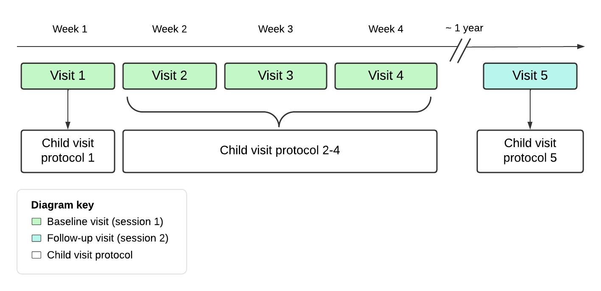

# Study Design {#study-design}

Study REACH involves a total of 5 visits for parent-child dyads.

The first 4 visits occur \~1 week apart; these are referred to as baseline or session 1 visits. The 5th visit occurs \~1 year after baseline; this visit is referred to as follow-up or session 2 \@ref(fig:reach_visits).

The 4 baseline visits include: Child Visit Protocol 1, Child Visit Protocol 2, Child Visit Protocol 3, and Child Visit Protocol 4. Child Visit Protocol 1 always occurred on the first study visit, while Child Visit Protocols 2-4 could vary in order due to MRI availability. The follow-up visit includes Child Visit Protocol 5.

```{r reach_visits, fig.cap='Timeline of REACH visits and their associated child visit protocols', out.width='80%', fig.asp=.75, fig.align='center', echo=FALSE}
   
```

Parents completed sets of questionnaires for each of the 5 visits.

## Baseline visits (session 1) {#baseline-visits}

### Visit 1

#### Child Visit Protocol 1

### Visits 2-4

#### Child Visit Protocol 2

#### Child Visit Protocol 3

#### Child Visit Protocol 4

## Follow-up (session 2) {#follow-up-visits}

### Visit 5

#### Child Visit Protocol 5

#### Parental Questionanires
